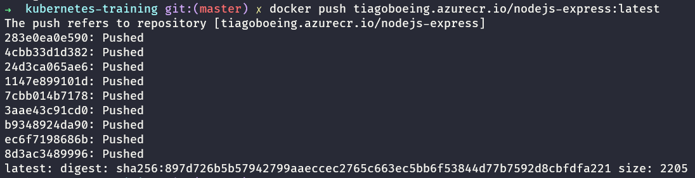
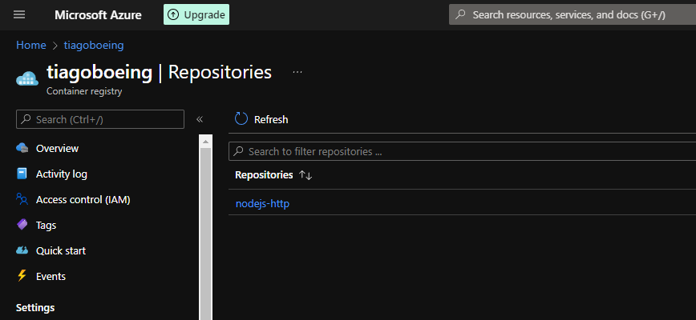

# Maratona Kubernetes - Azure (Microsoft Brasil)

> [Link da playlist](https://www.youtube.com/playlist?list=PLB1hpnUGshULerdlzMknMLrHI810xIBJv)

---

* [Maratona Kubernetes - Azure (Microsoft Brasil)](#maratona-kubernetes---azure-microsoft-brasil)
    * [Cheatsheet](#cheatsheet)
  * [Steps overview](#steps-overview)
  * [Authentication](#authentication)
  * [Resource groups](#resource-groups)
  * [Container registry](#container-registry)
    * [Docker image](#docker-image)
  * [Azure Container Instances](#azure-container-instances)
    * [Removing Container Instances](#removing-container-instances)
  * [Azure Kubernetes Service](#azure-kubernetes-service)
    * [Instal AKS CLI](#instal-aks-cli)
    * [Creating cluster](#creating-cluster)
    * [Binding local k8s with Azure AKS](#binding-local-k8s-with-azure-aks)
    * [Open AKS dashboard](#open-aks-dashboard)
    * [Managing pods](#managing-pods)
      * [Iterative model](#iterative-model)
      * [Exposing by service - LoadBalancer](#exposing-by-service---loadbalancer)
      * [Declarative model](#declarative-model)
    * [Secrets](#secrets)
      * [Creating secret](#creating-secret)
      * [Using secret](#using-secret)
    * [ReplicaSet](#replicaset)

### Cheatsheet

- [Connect](#binding-local-k8s-with-azure-aks)
- Documentation:
  - Explain: `kubectl explain pods`
- Namespaces
  - Create: `kubectl create namespace <NAME>`
- Events
  - Sorted by timestamp: `kubectl get events --sort-by=.metadata.creationTimestamp`
- Pods
  - Run: `kubectl run <POD-NAME> --image <IMAGE>:<VERSION> --port 27017`
  - Create from file: `kubectl create -f pods/nodejs-express.json`
  - Get
    - Only pod: `kubectl get pod <POD-NAME>`
    - Configs:
      - YAML: `kubectl get pod <POD-NAME> -o yaml`
      - JSON: `kubectl get pod <POD-NAME> -o json`
      - Get specific property: `kubectl get pod <POD-NAME> -o yaml | grep podIP`
    - Deleted pods: `kubectl get event -o custom-columns=NAME:.metadata.name | cut -d "." -f1`
  - View: `kubectl get pods` or `kubectl get pods -o wide`
  - Delete: `kubectl delete pod <POD-ID>`
    - Delete by label: `kubectl delete pod -l version=v1`
  - Describe: `kubectl describe pod <POD-NAME>`
  - Monitoring usage: `kubectl top pod mongodb`
  - Expose: `kubectl expose pod <POD-NAME> --port <PORT> --type LoadBalancer`
  - Exec commands:
    - bash: `kubectl exec -it <POD-NAME> -- /bin/bash`
    - sh: `kubectl exec -it <POD-NAME> -- /bin/sh`
- Logs
  - View: `kubectl logs <POD-NAME>`
- Services
  - List: `kubectl get service`
- Secrets
  - List: `kubectl get secret`
  - Describe: `kubectl describe secret <SECRET-NAME>`
- Deployments
  - Scale: `kubectl scale deployment <NAME> --replicas=<NUMBER>`
  - Autoscale (HPA): `kubectl autoscale deployment <NAME> --min=<NUMBER> --max=<NUMBER> --cpu-percent=<NUMBER>`

## Steps overview

1. Download & install & configure the [AZ CLI](https://docs.microsoft.com/pt-br/cli/azure/);
2. [Set a subscription to send commands](#authentication);
3. [Create a resource group to separate the resources inside the Azure in different scopes](#resource-groups);
4. [Create a Container Registry (CR) to receive the Docker images](#container-registry);
5. [Prepare the Docker image and send to Container Registry](#docker-image);
6. Deploy types
   1. [Azure Container Instances](#azure-container-instances)
   2. [Azure Kubernetes Service](#azure-kubernetes-service)

## Authentication

```bash
# Login on account
az login

# Define subscription to use
az account set --subscription "NAME"
```

## Resource groups

```bash
# Create resource group
az group create --name "kubernetes-training" --location eastus
```

## Container registry

The container registry is the place where we use it to store de Docker images. All images are private on the registry and Azure has 12 months free tier.

```bash
# Create Container registry
# name - need to be unique
# will generate a unique URL, something like that: tiagoboeing.azurecr.io
az acr create --resource-group "kubernetes-training" --name "tiagoboeing" --sku Basic

# Login on Container registry
az acr login --name "tiagoboeing"

# List
az acr list --resource-group kubernetes-training --output table
```

### Docker image

Before sending to Container Registry, we need to create a tag to our Docker image containing the registry name.

> Registry name: **tiagoboeing.azurecr.io**

```bash
# Creating tag
docker tag tiagoboeing/nodejs-express:latest tiagoboeing.azurecr.io/nodejs-express:latest

# Search by image
docker image list | grep nodejs-http
```

Now, It's possible to push the image to CR, do a copy from tag created on the last step (`tiagoboeing.azurecr.io/nodejs-express:latest`):

```bash
# Send image to CR
docker push tiagoboeing.azurecr.io/nodejs-express:latest
```



Looking at the Azure console you can see the image on "repositories" menu:



## Azure Container Instances

[Product page](https://azure.microsoft.com/en-us/services/container-instances/)

In our example we've:

- ACR=**tiagoboeing**
- RESOURCE GROUP=**kubernetes-training**
- LOCATION=**eastus**

Let's create a Container Instances for each service:

<details>
  <summary>mongo</summary>
  
```bash
az container create --resource-group kubernetes-training \
  --name mongodb \
  --cpu 0.5 --memory 0.5 \
  --image mongo:4.4.11 \
  --port 27017 \
  --ip-address public
```

> `--image mongo:4.4.11` = same from docker-compose

Verify the container logs to check if service is up.

```bash
az container logs --resource-group kubernetes-training --name mongodb
```

And get the container IP:

```bash
az container show --resource-group kubernetes-training --name mongodb --query ipAddress.ip
```

> In this example the IP is: `52.226.198.59`

</details>

<details>
  <summary>nodejs-express</summary>

For this service we need to authenticate to allow the image pull.

```bash
# Enable admin mode on CLI
az acr update -n tiagoboeing --admin-enabled true

# Get Container Registry password
az acr credential show -n tiagoboeing --query passwords
```

> Password in this example is: `yyyIvQaipNjFzWdi22ZX91xx23pC/88Z`

With the password we can configure the deploy:

```bash
az container create --resource-group kubernetes-training \
  --name nodejs-express \
  --cpu 0.5 --memory 0.5 \
  --image tiagoboeing.azurecr.io/nodejs-express:latest \
  --port 3000 \
  --environment-variables MESSAGE='Running on Azure' MONGO_URL=52.226.198.59 \
  --registry-username tiagoboeing \
  --registry-password yyyIvQaipNjFzWdi22ZX91xx23pC/88Z \
  --ip-address public
```

> `image` use the same pushed to Container Registry.

```bash
# see logs (again)
az container logs --resource-group kubernetes-training --name nodejs-express

# get ip address (yes, again)
az container show --resource-group kubernetes-training --name nodejs-express --query ipAddress.ip
```

</details>

---

### Removing Container Instances

```bash
az container delete --resource-group kubernetes-training --name nodejs-express --yes
az container delete --resource-group kubernetes-training --name mongodb --yes
```

## Azure Kubernetes Service

[Product page](https://azure.microsoft.com/en-us/services/kubernetes-service/)

### Instal AKS CLI

> [Video - module 4 - lesson 4](https://www.youtube.com/watch?v=IlKALzJn5nQ&list=PLB1hpnUGshULerdlzMknMLrHI810xIBJv&index=21&t=322s&ab_channel=MicrosoftBrasil)

```bash
az aks install-cli
```

### Creating cluster

```bash
az aks create -g kubernetes-training \
  --name k8s-cluster \
  --dns-name-prefix k8s-cluster \
  --generate-ssh-keys \
  --node-count 2
  --node-vm-size Standard_A1_v2
```

**Info**

- `-g` it's a alias to `resource-group`
- It's possible specify de [VM size](https://docs.microsoft.com/azure/virtual-machines/sizes) to improve costs with `--node-vm-size` parameter.

> The creation step usually takes 15 minutes on average.

### Binding local k8s with Azure AKS

> [Video - module 4 - lesson 4](https://www.youtube.com/watch?v=IlKALzJn5nQ&list=PLB1hpnUGshULerdlzMknMLrHI810xIBJv&index=21&t=322s&ab_channel=MicrosoftBrasil)

```bash
az account set --subscription SUBSCRIPTION-ID
az aks get-credentials --resource-group kubernetes-training --name k8s-cluster
# now you can use "kubectl" commands
```

### Open AKS dashboard

```bash
az aks browse --resource-group kubernetes-training --name k8s-cluster
```

### Managing pods

#### Iterative model

```bash
kubectl run mongodb --image mongo:4.4.11 --port 27017

# And to see pods, run:
kubectl get pods -o wide

# get the pod IP and overwrite on env

kubectl run nodejs-express \
  --image tiagoboeing/nodejs-express:latest \
  --env="MONGO_URL=10.244.1.8" \
  --env="MESSAGE=Running on AKS"
```

#### Exposing by service - LoadBalancer

```bash
kubectl expose pod nodejs-express --port 3000 --type LoadBalancer

# Get the service IP
kubectl get service

# Get service IP and access
curl 52.179.115.234:3000
# the output will be: "<h1>Hello from NodeJS Service A</h1>"
```

#### Declarative model

Here, we're using [this pod specs](./pods/nodejs-express.json) to deploy.

1. Create deployment file (`.json` or `.yaml/.yml`) - [commit](https://github.com/tiagoboeing/kubernetes-training/commit/864bfbf9528250770b3158984773197e0554bcba#diff-914cf53cbfe559f57b89ab8496dbd19a9360b864e80378f8462772354c920b8c);
2. Create pod with `kubectl create -f pods/nodejs-express.json`

### Secrets

> [Video - module 6 - lesson 2](https://www.youtube.com/watch?v=4sENTISxzew&list=PLB1hpnUGshULerdlzMknMLrHI810xIBJv&index=28&ab_channel=MicrosoftBrasil)

Now, we'll use the image from private Container Registry and test, we need to receive a error because [this pod spec](./secrets/nodejs-express.json) still not use the secrets to authenticate.

> In this case our registry address is: `tiagoboeing.azurecr.io` and the image tag is `tiagoboeing.azurecr.io/nodejs-express:latest`

#### Creating secret

```bash
kubectl create secret docker-registry acr-credentials \
  --docker-server=tiagoboeing.azurecr.io \
  --docker-username=tiagoboeing \
  --docker-password=yyyIvQaipNjFzWdi22ZX91xx23pC/88Z \
  --docker-email=contato@tiagoboeing.com

# The password from this example is the above
```

> To see the ACR password, run: `az acr credential show -n tiagoboeing --query "passwords[0].value"`

#### Using secret

Inside `spec` object, add the following properties:

```json
{
  "imagePullSecrets": [
    {
      "name": "acr-credentials"
    }
  ]
}
```

Delete and create the pod again:

- `kubectl delete -f secrets/nodejs-express.json`
- `kubectl create -f secrets/nodejs-express.json`

### ReplicaSet

Use to create ReplicaSet based on file:

```bash
kubectl apply -f replicasets/nodejs-express.json
```